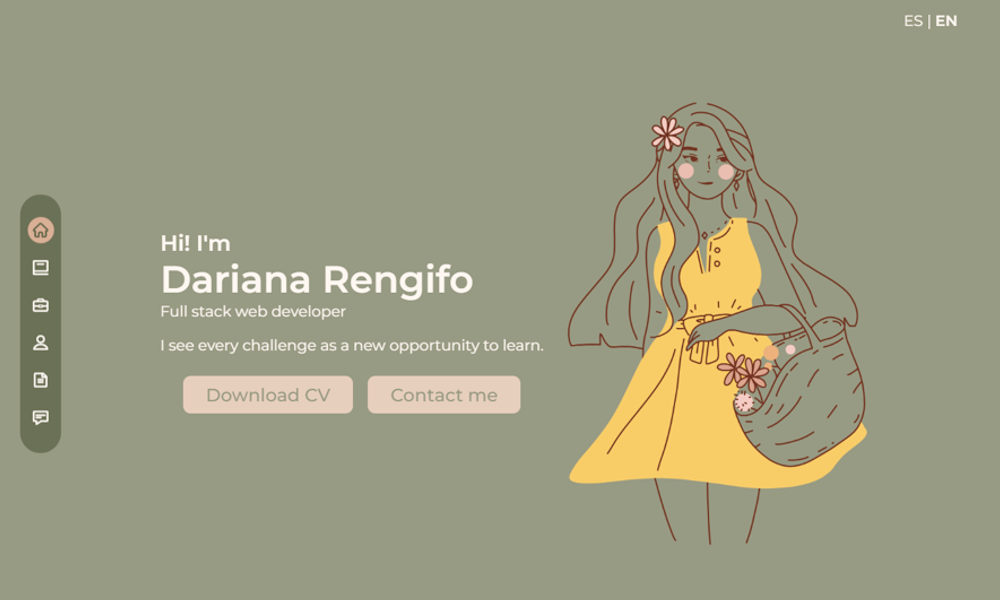

# My Portfolio

This project was generated with [Angular CLI](https://github.com/angular/angular-cli) version 15.1.6.

This portfolio is the first of many projects where I will implement Angular and TypeScript. Using TypeScript allowed me to get more accurate code, with fewer errors, simpler, more consistent and easier to test. And in turn, Angular 15 gave me the ability to quickly create UI views with a very simple and efficient template syntax.

## Key accomplishments
- Develop a single page application (SPA).
- Reactive form with validations.
- Multilanguage application
- Communication between components

## Tech Stack

## Deploy 🌐: [My Portfolio](https://portfolio-jx0i14drm-darianaren.vercel.app/home)

# I hope you enjoy it.
